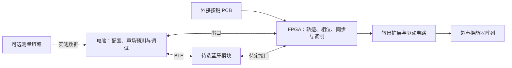

# 触见：超声触觉图形显示器

面向视障人群的基础图形与方向信息感知，探索利用超声在手掌处产生触觉反馈。

2026 年全国大学生嵌入式芯片与系统设计竞赛 FPGA 创新设计赛道参赛准备项目。

> 更新于 **2026-09-25**。已有可运行的电脑上位机、Windows 便携 EXE、Demo 模拟设备、双向串口与 BLE 适配。设备协议仍是上位机侧草案，待与 FPGA 端共同确定；蓝牙模块未选定。硬件仍处于方案设计与选型阶段，尚无 RTL、PCB 工程或硬件实测结果；软件演示不代表触觉效果已验证。

## 项目简介

项目拟以 Tang Mega 60K 为核心，由 FPGA 完成焦点相位计算、多通道同步控制和触觉调制，通过控制焦点的位置与运动轨迹，探索点、直线、圆等简单图形的触觉呈现。硬件先做 4×4，再扩展到 8×8；16×16/256 路作为后续方向，最终规模与驱动方案由样机测试决定。

设备保留外接 PCB 按键，支持不连接电脑时选择和播放预设图形。电脑拟通过串口或 BLE 提供参数配置、声场预测、状态监控和测量数据分析，实时轨迹执行与相位输出在 FPGA 内完成。BLE 需配套模块与固件，当前已完成电脑端适配及软件夹具验证。

## 系统组成



Tang Mega 60K 是 Sipeed 开发板，搭载高云 FPGA；具体底板版本、引脚分配与工具配置应对照[官方资料](https://wiki.sipeed.com/hardware/zh/tang/tang-mega-60k/mega-60k.html)确认。

## 当前设计方向

| 部分 | 计划内容 | 尚待确定 |
|---|---|---|
| FPGA | 板内相位求解、轨迹播放、同步输出 | 定点位宽、资源占用、实测更新率 |
| 阵列与驱动 | 从小规模验证扩展至模块化阵列 | 换能器、间距、驱动器、供电与最终通道数 |
| 本地操作 | PCB 外接按键，选择、播放和停止图形 | 按键数量、状态指示与接口 |
| 放手引导 | 拟采用可调腕托／定位凹槽与操作语音 | 结构尺寸、工作高度、手型适配及语音载体，均未实现 |
| 电脑软件 | 已实现组合草图、几何关系与尺寸、手掌预览、Demo、串口与 BLE 适配 | 协议共同定稿、蓝牙选型、FPGA 固件与真实板卡联调 |
| 传感器 | 接收器用于校准；手部跟踪后置 | 接收前端、ADC、手部传感器选型 |

## 实施顺序

1. 核对板卡引脚，完成按键、串口和低压数字输出验证。
2. 验证单通道及少量驱动通道的电气性能。
3. 制作小阵列，比较计算相位、测量声场和预测结果。
4. 评估固定焦点触感与简单轨迹，再决定是否扩展至 256 路。
5. 完成独立演示、图形辨识实验及性能记录。

64 路是中间验证规模，不代表已能获得足够触感；多焦点、手部跟踪、语音图形教学及声悬浮属于后续扩展。基础放手与操作语音拟纳入首版交互。声场预测不能代替实际触觉验证。

## 文档导航

- [设计思路](设计思路.md)：当前架构、按键与串口分工、硬件选型、验证步骤和待决策事项。
- [交互与放手引导提案](交互与放手引导提案.md)：腕托与语音、使用流程、手掌示意、既定软件交互和实现状态。
- [上位机使用说明](desktop_app/README.md)：组合草图、尺寸和顺序、手掌预览、Demo 与数据边界。
- [HAP3 设备协议草案](desktop_app/PROTOCOL.md)：坐标路径、设备能力声明、完整配置提交、原子状态快照和看门狗。
- [BLE 对接说明](desktop_app/BLE.md)：电脑端连接、可替换模块配置、双向收发和协议待决事项。
- [选题调研](FPGA赛道选题建议%281%29.md)：原始候选方案和参考资料；推荐排序及部分判断属于历史调研。
- [贡献指南](AGENTS.md)：文档维护、核验和提交约定。
- [项目上下文](CLAUDE.md)：协作时需要了解的背景与约束。

当前方案以 `设计思路.md` 为准。旧调研中的性能目标、价格、赛事规则及“未检索到同类作品”等表述，不应直接当作实测结果或最新事实引用。

## 运行与测试

使用 Python 3.10+（含 Tk），在仓库根目录执行：

```powershell
python -m pip install -r desktop_app/requirements.txt
python -m desktop_app --demo
python -m unittest discover -s desktop_app/tests -v
```

可选 GUI 集成测试：`python -m desktop_app.tests.gui_smoke`。Windows 64 位可用 PyInstaller 构建独立 EXE，见[启动与打包说明](desktop_app/README.md#启动)；本机构建产物位于 `desktop_app/dist/`，不提交到 Git。本机测试环境：Python 3.10.11、Tk 8.6、NumPy 2.2.6、pyserial 3.5；实际打包依赖版本记录在 `build-info.json`，截图需要 Pillow。无格式化器、HDL 构建或 RTL 仿真命令。

上位机默认打开草图编辑器，支持连续直线、矩形、圆、拖动成圆弧和控制点曲线，可组合多个轮廓、擦除线条、设置必要几何关系与尺寸、整体倍数缩放和指定呈现顺序。原打点操作已并入连续直线工具。公共线按顺序仅呈现一次，段间关闭输出；编译后最多 32 段、256 个坐标。图形按实际坐标保存，换阵列不会改变位置。Demo 可设置 4×4、6×6、8×8、12×12、16×16 及自定义行列；真实硬件规模由 FPGA 握手声明。普通界面保留绘图与播放，勾选“调试模式”查看相位、声场和串口日志。

顶部按钮可直接选圆、正方形、三角形、直线、箭头等基本图案，并预览待发送的形状。点击“发送到设备”后，在“播放画面”查看接收确认；确认前播放按钮置灰。播放后的亮点来自设备回传，暂停、停止和失联均有反馈。更改图形或重新连接后需再次发送确认。

“保存图形”生成 JSON，使用“导入图形”恢复编辑，支持 `Ctrl+S`／`Ctrl+O`，并显示文件名与未保存状态。预览与播放画面已使用手掌示意背景，图形保持实际坐标；手掌不是检测结果，实体腕托、语音与手部跟踪仍待实现。

硬件路线采用单焦点沿轮廓高速循环扫描，电脑一次下发完整图形，FPGA 自主执行。当前 Demo 默认两秒一圈，仅演示路径与通信；高速更新及触觉辨识效果尚未验证。

板卡入门可参考 [Sipeed 官方示例](https://github.com/sipeed/TangMega-60K-example)。项目内不存放账号密码、访问令牌或与本作品无关的个人文件。
