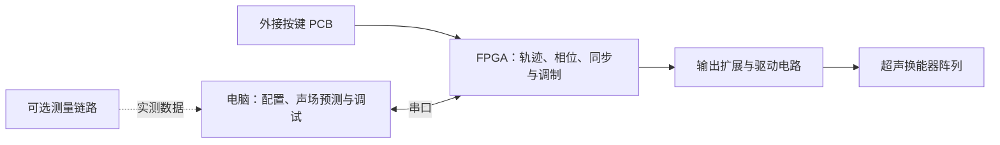

# 触见：超声触觉图形显示器

面向视障人群的基础图形与方向信息感知，探索利用超声在手掌处产生触觉反馈。

2026 年全国大学生嵌入式芯片与系统设计竞赛 FPGA 创新设计赛道参赛准备项目。

> 更新于 **2026-09-24**。当前处于方案设计与器件选型阶段。本仓库已整理设计文档，尚未提交 RTL、PCB 工程或上位机软件，也没有硬件实测结果。下文描述的是计划功能。

## 项目简介

项目拟以 Tang Mega 60K 为核心，由 FPGA 完成焦点相位计算、多通道同步控制和触觉调制，通过控制焦点的位置与运动轨迹，探索点、直线、圆等简单图形的触觉呈现。阵列暂按四组 64 通道扩展至 256 路的方向规划，最终规模与驱动方案由样机测试决定。

设备保留外接 PCB 按键，支持不连接电脑时选择和播放预设图形。电脑通过串口提供参数配置、声场预测、状态监控和测量数据分析，实时轨迹执行与相位输出在 FPGA 内完成。

## 系统组成

Tang Mega 60K 是 Sipeed 开发板，搭载高云 FPGA；具体底板版本、引脚分配与工具配置应对照[官方资料](https://wiki.sipeed.com/hardware/zh/tang/tang-mega-60k/mega-60k.html)确认。

## 当前设计方向

| 部分 | 计划内容 | 尚待确定 |
|---|---|---|
| FPGA | 板内相位求解、轨迹播放、同步输出 | 定点位宽、资源占用、实测更新率 |
| 阵列与驱动 | 从小规模验证扩展至模块化阵列 | 换能器、间距、驱动器、供电与最终通道数 |
| 本地操作 | PCB 外接按键，选择、播放和停止图形 | 按键数量、状态指示与接口 |
| 电脑软件 | 串口控制台与声场可视化 | 软件框架、协议细节、测量接入方式 |
| 传感器 | 接收器用于校准；手部跟踪后置 | 接收前端、ADC、手部传感器选型 |

## 实施顺序

1. 核对板卡引脚，完成按键、串口和低压数字输出验证。
2. 验证单通道及少量驱动通道的电气性能。
3. 制作小阵列，比较计算相位、测量声场和预测结果。
4. 评估固定焦点触感与简单轨迹，再决定是否扩展至 256 路。
5. 完成独立演示、图形辨识实验及性能记录。

64 路是中间验证规模，不代表已能获得足够触感；多焦点、手部跟踪、语音辅助及声悬浮属于后续扩展。声场预测不能代替实际触觉验证。

## 文档导航

- [设计思路](设计思路.md)：当前架构、按键与串口分工、硬件选型、验证步骤和待决策事项。
- [选题调研](FPGA赛道选题建议%281%29.md)：原始候选方案和参考资料；推荐排序及部分判断属于历史调研。
- [贡献指南](AGENTS.md)：文档维护、核验和提交约定。
- [项目上下文](CLAUDE.md)：协作时需要了解的背景与约束。

当前方案以 `设计思路.md` 为准。旧调研中的性能目标、价格、赛事规则及“未检索到同类作品”等表述，不应直接当作实测结果或最新事实引用。

## 开发状态

目前没有构建、仿真、串口软件启动或自动测试命令。后续引入工程时，应同步提供工具版本、可复现命令、引脚约束与测试记录。

板卡入门可参考 [Sipeed 官方示例](https://github.com/sipeed/TangMega-60K-example)。项目内不存放账号密码、访问令牌或与本作品无关的个人文件。
