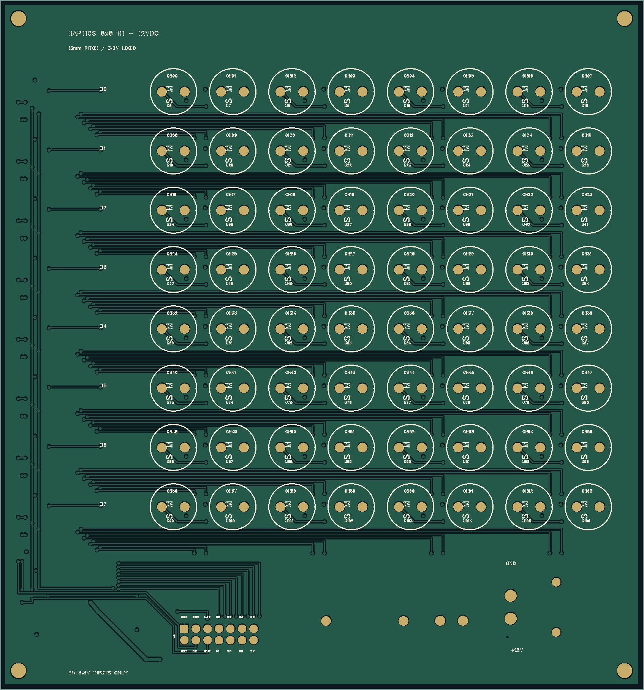
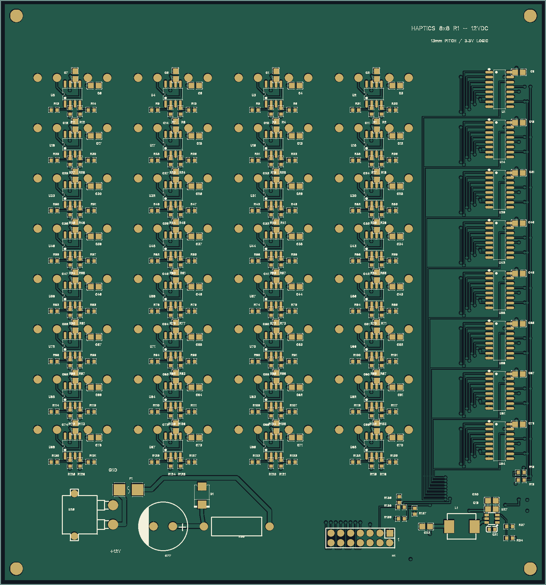

# 8×8 发射板 R1：12 V DC

更新于 **2026-10-08**。基于同学提供的 `ProPrj_haptics_8_8_2026-10-07.epro2`，完成原理图核对、手工布局布线与制造文件检查。原文件未覆盖。

本版为 **141 × 151 mm、四层、13 mm 阵列间距**，使用 64 个 MA40S4S、32 个 TC4427A 和 8 个 SN74LV595A。按行设置走线通道，控制干线集中于左侧，驱动器放在相应换能器附近。最终走线路径由明确的手工拐点确定，未使用自动布线或路径搜索。

本次复核缩短了 U27 的输入电容局部回路与 SW 到电感的连接；公共时钟主干移至顶层，SRCLK/RCLK 信号过孔由各 18 个减至 9/11 个，并在换层处补充地过孔。具体位置及实际线长见核验报告。

进一步自检修复了 211 个电阻、电容共 422 个焊盘缺少焊膏开窗的问题。已重新导入、明确打开修正版工程，并从 EDA 重新导出制造文件；不要使用之前缺少开窗的 Gerber 制作钢网。

## 文件

| 文件 | 用途 |
|---|---|
| [Haptics_8x8_R1_release.epro2](Haptics_8x8_R1_release.epro2) | 嘉立创 EDA 专业版可编辑工程，包含原理图、PCB 与器件库 |
| [Haptics_8x8_R1_release_Gerber.zip](Haptics_8x8_R1_release_Gerber.zip) | 四层制造文件，毫米 4:6 坐标，含钻孔 |
| [BOM.csv](BOM.csv) / [Positions.csv](Positions.csv) | 324 个器件的物料与装配坐标；坐标原点为板框左上，Y 向下，角度为 CAD 原值 |
| [transducer_map.json](transducer_map.json) | 64 路位置、驱动器、移位寄存器与串行位映射；不是上位机图形文件 |
| [routing_geometry.json](routing_geometry.json) | 从最终工程提取的线段和过孔，便于逐条审查；不生成走线 |
| [核验报告.md](核验报告.md) / [validation.json](validation.json) | 检查结果、修改与待实测事项 |
| [copper_validation.json](copper_validation.json) | Gerber 实际铜形状的连通、间距及封装外形复核 |
| [manufacturing_validation.json](manufacturing_validation.json) | 钻孔位置/孔径与贴片焊盘开窗中心覆盖检查 |
| [SHA256SUMS.txt](SHA256SUMS.txt) | 交付文件校验值 |

## 接口与软件

H1 为底面 2×7 接口。**按方形焊盘的 1 脚及原生工程编号接线**；从底面看时位置相对于顶视图镜像。

| 奇数脚 | 信号 | 偶数脚 | 信号 |
|---|---|---|---|
| 1 | GND | 2 | GND |
| 3 | SRCLK 输入，经 R135 33 Ω | 4 | OE_N，高电平关闭 |
| 5 | RCLK 输入，经 R136 33 Ω | 6 | SRCLR_N，低电平清移位寄存器 |
| 7 | DATA0，第 0 行 | 8 | DATA1，第 1 行 |
| 9 | DATA2，第 2 行 | 10 | DATA3，第 3 行 |
| 11 | DATA4，第 4 行 | 12 | DATA5，第 5 行 |
| 13 | DATA6，第 6 行 | 14 | DATA7，第 7 行 |

逻辑电平为 3.3 V；发射板从 XT30 输入 12 V DC，自带逻辑降压。控制器与发射板共地，H1 不向控制器供电。时钟与数据线应短，并随线提供地参考。

每次更新同时在 8 根 DATA 线上移入 8 位，各行先发 bit7、最后发 bit0，然后统一锁存。清零顺序为 `OE_N=1 → 移入全零 → RCLK 锁存 → 按需使能`；SRCLR_N 不清输出锁存器。

**现有 F103/F411 直接 GPIO 固件及 FPGA 原型不能直接驱动本接口。** 需要新增并验证 8 路并行移位输出。40 kHz、64 相位级时，仅移位需要至少 20.48 MHz 时钟，锁存与建立时间还需预算，详见报告。

## 检查与预览

重建全部铺铜后，原生 DRC 重跑为 0；原生网表对比无差异。独立铜几何检查覆盖 970 个器件焊盘、214 个有效网络及 495 个过孔，未发现断路、短接或孤立铜；最小网络间距约 0.159 mm。324 个封装外形未重叠或越界，649 个孔的最小孔壁间距约 0.395 mm。尚未制作实板，输出时序、功耗、温升、声场及触觉均未实测。

在仓库根目录复核文件与连接：

```powershell
python hardware/Haptics_8x8_R1_12VDC/verify_release.py
```

复核实际铜形状需另外安装审计依赖，建议使用独立虚拟环境：

```powershell
python -m pip install -r hardware/Haptics_8x8_R1_12VDC/requirements-audit.txt
python hardware/Haptics_8x8_R1_12VDC/verify_copper.py
python hardware/Haptics_8x8_R1_12VDC/verify_manufacturing.py
```

脚本只读文件，不修改或布线；不替代原生 DRC。铜检查考虑各层实际铜形状及全通孔连接，曲线采用近似多边形；器件外形来自封装外形层，不包含连接器插头与线缆。`export_tables.py` 可重新提取表格；`render_previews.py` 需 PyGerber 2.4.3 与 Pillow，只渲染 Gerber。

制造检查逐一核对 649 个钻孔的位置与孔径，以及 820 个贴片焊盘中心是否有阻焊、焊膏开窗；包括偏心孔的焊盘旋转和底面镜像。它不评估钢网厚度、焊膏量、开窗工艺或装配公差。

重新导出前，在 PCB 画布按 **Shift+B 重建全部铺铜并保存**，再用 [export_gerber.js](export_gerber.js) 在 EDA「高级 → 运行脚本」中执行。脚本逐个检查当前铺铜区域是否有填充结果，缺失时停止导出。此版没有独立铜填充区域，排除 `SolidRegion` 可避免 XT30 模型标识被错误导出为铜点；若以后添加铜填充区域，脚本会要求重新审查导出设置。铺铜、焊盘、过孔和导线均正常导出。

以下为实际导出文件渲染，底面已翻转为从背面观看。颜色仅用于区分铜、阻焊开窗和丝印，钻孔以 DRL 为准。





四层顺序为顶层 → 完整 GND 内层 → 3.3 V/12 V 分区内层 → 底层。下单使用四层普通全通孔工艺；旧 4×4 机械定位件的板框、安装孔和阵列间距不能直接套用本板。
