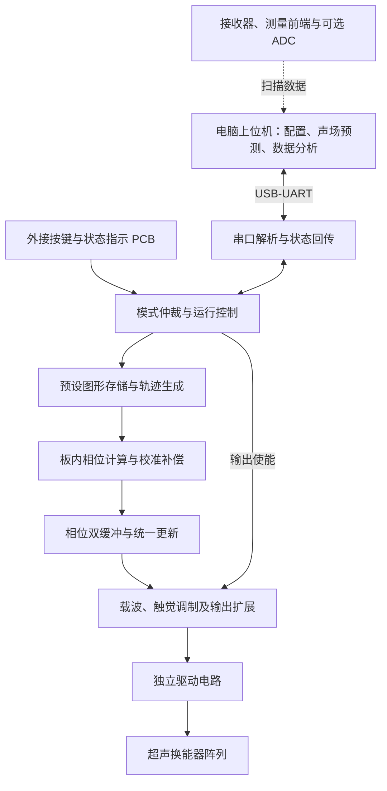

# 触见：超声触觉图形显示器——设计思路

更新日期：2026-09-24

本文记录团队当前讨论形成的方案，用于分工、选型和联调。除明确注明的板卡资料与研究参考外，以下均为设计计划，尚未实现或实测。参数和接口草案需在样机验证后冻结。

## 1. 项目目标与范围

面向视障人群对基础图形和方向信息的感知需求，探索把简单形状和运动轨迹转化为手掌可感知的超声触觉刺激。首阶段验证“是否感觉得到、是否能区分简单图形”，不预先承诺复杂地图、精细轮廓或成熟无障碍产品能力。

| 已明确的方向 | 实现上仍待确定 |
|---|---|
| 主控选用 Tang Mega 60K，核心实时逻辑放在 FPGA | 实际底板版本、可用 GPIO、定点算法与时钟配置 |
| 保留外接 PCB 按键，预设图形可独立选择与播放 | 按键数量、指示方式、连接器和引脚 |
| 电脑通过串口与 FPGA 通信，兼顾预测和调试 | 软件框架、协议编码、回传频率与测量接口 |
| 以单焦点和简单轨迹为首版核心 | 工作高度、轨迹范围、调制方式和可辨识图形 |
| 考虑四组 64 通道拼成 256 路阵列 | 换能器、驱动电路、模块尺寸及最终阵列规模 |

Tang Mega 60K 是 Sipeed 推出的开发板，使用高云 FPGA。GPIO 电平与接口复用应以实际板卡原理图为准，不能把不同连接器上的复用信号重复计数。资料入口见第 9 节。[1]

## 2. 系统架构



测量链路的接入方式尚未确定：初期可由示波器记录并导入电脑，后期再评估由 ADC 采样、FPGA 整理后经串口回传。没有测量硬件时，上位机只能显示计算结果和数字运行状态。

### 2.1 FPGA 和电脑的分工

- **FPGA**：处理按键与命令，执行轨迹，计算各通道相位，完成统一更新、载波输出和触觉调制；保存必要的运行状态。
- **电脑**：设置参数、选择图形、预览声场、下载轨迹、查看回传状态和分析测量数据。界面刷新与硬件实时输出解耦。
- **驱动电路**：把控制信号转换成适合所选换能器的电气激励。供电、电流能力和负载波形需单独验证。

独立运行是功能要求，但“拔掉电脑仍播放”本身不能证明相位计算发生在 FPGA。应通过 RTL 仿真、板端中间结果和资源报告说明计算实现；预存轨迹点与预存完整相位表也应明确区分。

### 2.2 本地模式与联机模式

下列为建议的运行规则，需在固件与上位机开发前共同确认。

| 项目 | 本地独立模式 | 联机调试模式 |
|---|---|---|
| 配置入口 | 外接按键和板内预设 | 电脑串口 |
| 实时轨迹与相位计算 | FPGA | FPGA |
| 电脑断开 | 不影响已启动的本地任务 | 建议由板端心跳超时进入停止状态，超时值待定 |
| 图形来源 | 板内 ROM 或片内存储器 | 预设图形或一次下载并确认完整的轨迹 |
| 停止入口 | 本地停止键 | 本地停止键和串口停止命令 |

建议只允许在待机状态切换控制模式。本地停止键优先于所有启动命令；上电、复位后保持输出关闭，重新启动必须经过明确操作。串口连接或软件重连不能自动启动阵列。

## 3. FPGA 内部设计

### 3.1 数据通路

建议按下列边界拆分模块，具体命名在建立 RTL 工程时确定：

1. **输入与状态机**：按键同步及消抖、串口解析、模式仲裁、运行与错误状态。
2. **轨迹发生器**：从固定点、水平线、竖直线、圆开始；三角形和箭头作为候选。参数包括中心、尺寸、播放速度和焦点高度。
3. **相位求解器**：由阵元坐标和目标坐标计算传播距离、相位，再叠加校准补偿；定点实现与电脑参考模型逐项对照。[3]
4. **缓冲与同步**：后台计算下一组相位，完整后统一切换；明确更新时刻，避免不同通道使用不同代参数。
5. **波形与调制**：产生载波与调制时序，协调输出使能；相位跳变和异常命令下的波形必须检查。
6. **状态回传**：返回当前模式、图形、已生效参数、相位更新计数、错误码及协议版本。

40 kHz 载波、至少 64 级相位量化、1～10 kHz 相位更新率可作为首轮评估参数，均不是已实现指标，也不作为触觉效果保证。最终选择取决于换能器、计算延迟、输出链路和测量结果。

区分三种频率：载波频率、相位更新率、整条轨迹重复率。例如每圈 100 个点、每秒更新 10,000 个点，在逐点匀速执行且无停顿时每秒重复 100 圈；不能把 10 kHz 写成图形重复率。

### 3.2 GPIO 扩展

先做真实的引脚分配表，再决定直连与并行移位链的比例。输出扩展应支持统一锁存或等效的同步更新，不预先固定“一个换能器占一个 FPGA 引脚”。

若采用逐时间片发送通道电平的移位方案，带宽预算为：

```text
单链净移位速率 = 每条链通道数 × 载波频率 × 每周期时间片数
示例：8 × 40,000 × 64 = 20.48 Mbit/s
```

该数值只计算有效数据，还需预留锁存和器件时序余量。若下级器件独立生成波形，必须按另一种接口重新计算。最终用器件数据手册和实测波形验证。

## 4. 硬件与外接按键

### 4.1 选型与 PCB

| 部件 | 计划用途 | 定型前需要确认 |
|---|---|---|
| 超声发射换能器 | 组成相控阵 | 频率响应、指向性、外径、额定驱动条件、批次一致性及供货 |
| 驱动器与输出扩展 | 激励换能器 | 逻辑电平、容性负载能力、输出幅值、温升和同步时序 |
| 接收换能器与前端 | 相对声场扫描、极性校准 | 频率响应、接收方向、增益、噪声、测量重复性 |
| ADC 或示波器接口 | 采集测量结果 | 采样链路、量程、带宽、同步方式和数据格式 |
| 手部位置传感器 | 后续随手调整焦点 | ToF 或摄像头方案的视场、延迟、遮挡与集成成本 |

首轮以 40 kHz 空气超声器件作为评估方向，具体型号尚未选定。先核对数据手册并测少量样品，再决定批量采购；不把此前讨论的示例器件视为最终 BOM。

PCB 工作按“少量通道驱动验证 → 64 通道模块 → 阵列扩展”推进。四块 8×8 模块拼接时，要把模块边缘和接缝处的阵元坐标纳入布局与计算；同时规划电源分配、公共参考地、锁存时序、连接器、测试点和模块编号。

开发板接口按匹配的低压逻辑设计，不能把驱动电源送入 GPIO。驱动供电、换能器两端的峰峰值电压和电源输入电压须分别记录，具体限值遵守所选器件资料。

### 4.2 按键与指示

按键放在设备外接 PCB 上，经 GPIO 接入 FPGA，不依赖开发板自带按键。首版建议四个功能键：

| 功能 | 建议行为 |
|---|---|
| 上一个图形 | 切换待选编号，不直接改变正在运行的图形 |
| 下一个图形 | 同上 |
| 播放／暂停 | 待机时启动；运行时暂停并关闭刺激输出 |
| 停止 | 关闭输出并回到待机，优先级最高 |

速度加减键可预留，数量尚未冻结。状态指示至少区分待机、运行、联机和故障；显示选中图形及实际运行图形，避免两者混淆。

按键输入需要同步、消抖和单次事件检测；消抖时间由所选按键测试确定。软件停止与硬件驱动使能分别检查，不能把未经验证的普通按键称作硬件急停。

## 5. 电脑软件与串口联调

### 5.1 可视化内容

电脑软件应同时服务于选型和实物联调，首版计划包含：

- 阵列布局、阵元坐标、焦点位置和简单轨迹预览。
- 理论声场切片与相对幅值分布，用于比较布局、间距和相位方案。
- 串口连接、参数下发、启动／停止、应答及运行状态。
- FPGA 相位计算抽样回读，与电脑参考结果比较。
- 导入接收器扫描数据；具备采集硬件后，再考虑在线回传和预测／实测对比。

界面必须区分**计算预测、FPGA 回读、传感器实测**。预测模型需记录假设、阵元坐标、频率、声速、相位量化和幅值归一化方式。初版可采用简化的线性声场叠加模型，再按器件资料与校准结果改进；热力图不能直接解释为触觉强弱或辨识率。[3][4]

尚未实现的软件不能展示虚构的已连接状态、测量数据或性能指标。当前也没有可启动的上位机程序。

### 5.2 通信边界与协议草案

正常运行发送高层参数或提前下载轨迹，FPGA 本地执行实时循环。串口并非绝对不能传相位表：校准、低速验证和结果回读可以传；不能未经带宽评估就依赖串口连续传完整相位帧。

以 115,200 baud、8N1 为预算示例，10 个串行位承载 1 字节，理想有效数据上限为 11,520 字节/秒；若每通道占 1 字节，256 通道一帧，不计协议开销也只能传约 45 帧/秒。该示例说明此配置不适合作为 10 kHz 相位帧的数据源，并不限制高层命令控制。

以下仅为可读文本协议的讨论稿，尚无对应固件。建议以换行结束一帧，先确定坐标单位、数值范围、最大报文长度和协议版本，再冻结语法：

```text
HELLO
MODE LOCAL
MODE REMOTE
SELECT CIRCLE
FOCUS 0 0 150
START
STOP
STATUS?
```

示例约定焦点坐标使用 mm，`FOCUS` 只设置目标，不隐含启动；`150` 是协议示例，不代表已验证工作高度。每条命令需关联应答，区分“收到”与“已生效”。越界、格式错误、截断或超长命令应拒绝，不能部分修改运行参数。

轨迹下载另行定义长度、顺序号、完整性校验和提交动作；传完并确认后才能播放。重连先读取实际状态，避免重复执行旧命令。所有模式都保留本地停止入口。

## 6. 分阶段验证与交付

以下为建议安排，不代表已完成进度。按原调研所记录的 2026-11-04 提交节点倒排，赛事日期、报名状态及高云赛道对第三方板卡的要求仍需在报名系统核实；该节点未在本次更新中重新核验。

| 阶段 | 建议时间 | 阶段出口 |
|---|---|---|
| 接口与选型 | 2026-09-24 至 2026-09-30 | 原理图候选、GPIO 表、按键与串口回读；低压相位输出可测 |
| 驱动与小阵列 | 2026-10-01 至 2026-10-10 | 单通道电气记录；少量通道相位与极性正确；完成相对声场扫描 |
| 64 通道与整机联调 | 2026-10-11 至 2026-10-20 | 聚焦位置可重复、校准流程可用；评估触感及扩展条件 |
| 扩展与量化 | 2026-10-21 至 2026-10-28 | 根据结果决定是否扩展；记录独立运行、计算性能及辨识结果 |
| 演示与材料 | 2026-10-29 至 2026-11-03 | 固定演示版本、报告、视频和已知限制 |

安排需结合器件交期调整，并为改板留出余量。64 路触感不足时，应先排查驱动、极性、声场和调制，再决定扩阵列；不能把“64 路必须摸得清图形”作为扩展前提，也不能未经测量就认为增加阵元一定解决问题。

验证按层归属负责人，不设置只负责测试的独立岗位：

- **数字逻辑**：相位计算误差、频率、统一更新、按键与串口仲裁、错误命令和复位行为。
- **电气与声场**：负载电压、电源电流、温升、通道一致性、焦点坐标和相对分布。未经校准的接收幅值只作相对量，不能标成准确的 Pa 或 dB SPL。
- **整机与体验**：本地离线操作、联机超时停止、连续运行、随机化图形辨识、正确率和辨识时间；记录参与条件和样本数，区分普通体验测试与视障用户验证。

各项记录保留板卡、固件、阵列布局和测试条件。触觉体验应在电气检查和超声暴露条件评估后开展，不能仅凭“听不见”认定适合人体测试。

## 7. 协作与近期决策

建议三人分别主责 **FPGA 与算法、硬件与阵列、上位机与系统集成**，各自承担模块验证，整机联调共同参与。具体成员分配由团队决定。

开始 PCB 定版前先完成：

1. 核对到手 Tang Mega 60K 的底板版本、原理图和空闲 GPIO。
2. 确定换能器样品、阵元间距、驱动拓扑和测量工具。
3. 约定坐标原点、轴方向、通道编号、极性标记及模块拼接位置。
4. 统一 FPGA 与电脑的定点单位、相位定义和串口字段。
5. 确定本地按键行为、联机心跳和输出关闭路径。

芯片资源、精度、刷新率、器件成本与用户效果都要用实现或实测支撑。已有 Zynq 研究已经包含板内相位加速，因此不能把“相位在 FPGA 内计算”单独称为首创。[3]

## 8. 后续扩展

在首版可重复运行后，按价值与工作量逐项选择：手部位置跟踪、语音辅助、教师自定义图形、多焦点、简化地图与方向提示、虚拟按钮及操作反馈。

声悬浮需要单独的声场与结构验证，不作为本作品的默认保底演示。[3] 扩展项目不能挤占单焦点触感、独立操作和性能记录的完成时间。

## 9. 参考资料与核验范围

以下资料用于技术依据与实现参考，2026-09-24 查阅；不代表本项目已经复现。

1. [Sipeed Tang Mega 60K 官方说明](https://wiki.sipeed.com/hardware/zh/tang/tang-mega-60k/mega-60k.html)：核对板卡型号、GPIO 电平、接口复用及工具要求。
2. [Sipeed TangMega-60K-example](https://github.com/sipeed/TangMega-60K-example)：板卡入门与外设示例，使用时记录实际版本。
3. [High-Performance Ultrasonic Levitation with FPGA-based Phased Arrays](https://arxiv.org/html/1901.07317v2)：相位计算、FPGA 加速与声场测量参考；声悬浮结果不能直接换算为本项目的触觉效果。
4. [SonicSurface 官方仓库](https://github.com/upnalab/SonicSurface)：开放阵列的算法、电子硬件、固件和结构资料，涉及触觉与声悬浮等应用。

换能器与驱动器型号、人体触觉效果、具体采购成本、2026 年高云赛道规则及日期尚未在本方案中完成核验，不能据此承诺成品性能或参赛资格。原始赛事与选题资料保留在 `FPGA赛道选题建议(1).md` 第 9 节。
